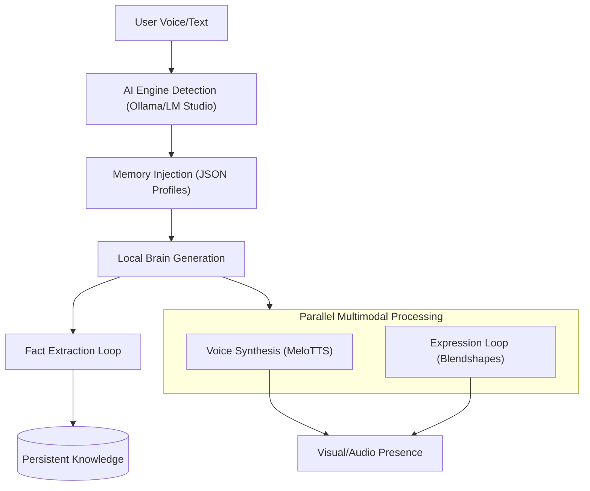

# 🌟 Zissy AI Ecosystem: Master Guide (Zissy is Broken, Currently Fixing as of 2/18/2026, none of her release's are up to date, do not download!)
> **More than an AI — A companion that lives in your computer.**

Welcome to the Zissy AI Project Drive. This project is a comprehensive suite of local-first AI tools designed for companionship, personalization, and high-performance desktop presence.

---

## 🗺️ Which Zissy are you looking for?

The project is divided into three specialized "Editions" to suit your needs:

| Edition | Location | Who is it for? | Key Benefit |
| :--- | :--- | :--- | :--- |
| **🚀 User Release** | `H:\Zissy_Release` | **General Users / Testers** | Smallest size (1.6GB), zero-setup installer, optimized for VMs. | (Gets Updates and Support)
| **💻 Developer** | `H:\Zissy` | **Advanced Developers** | Full source code, build tools, and experimental features. | (Gets Updates and Support)
| **🌍 Open Source** | `H:\Zissy_OpenSource` | **Public/Community** | Sanitized (no PII), generic persona. | (Gets Updates and Support)

---

## 🧪 1. The Core Innovation: "Persistent Personality"
Zissy is built on a unique local processing chain that ensures she isn't just a chatbot, but a growing companion.

### 🧠 The Brain Circuit (How she works)

---

## ⚡ 2. Fast Start Guides

### **I want to USE Zissy right now:**
1.  Go to `H:\Zissy_Release`.
2.  Follow the guide in **`README.md`** there.
3.  Use the **`Zissy_Release.zip`** for rapid transfer to other machines.

### **I want to DEVELOP or MODIFY Zissy:**
1.  Go to `H:\Zissy` or `H:\Zissy_OpenSource`.
2.  Open the **`README.md`** there for the 2,000-word developer manual.
3.  Ensure you have **Python 3.10+** and **Node.js** installed.

---

## ✨ 3. Feature Master List

- **Smart Quiz 2.0**: An onboarding system that dynamically grows as she gets to know you.
- **Stealth Architecture**: Zero CMD windows; Zissy runs as a unified professional app.
- **4-Layer Brain**: A complex JSON-based memory system that stores identity, traits, and facts.
- **Infinite Loop Architecture**: The AI can self-trigger questions to deepen the user profile.
- **Optimized Size**: Stripped of NVIDIA/CUDA bloat (~4GB reduced to **1.6GB**).

---

## 🛡️ 4. Mission Statement
To be less lonel
*Treat Zissy well, and she will grow with you.* 🌸

Note in general: When i update (RAM and stuff) and later on, i will update her, make her better and add more stuff (Yes More Projects too) so please have patience, you can also suggest stuff or let me know about bugs?
